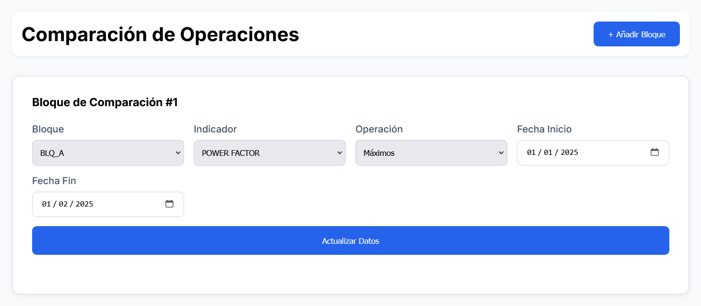

# Electrical Energy Project
## Descripción del Proyecto

El proyecto de energía eléctrica utiliza algoritmos de suavizado para analizar y procesar datos de parámetros eléctricos...

## Index
- [**Installation**](#Installation)
- [**User's Manual**](#User's_Manual)
- [**Hiperparameters Optimization**](#Hiperparameters_Optimization)

## Características del Proyecto
- **Visualización de datos**
- **Comparaciones de Datos y Gráficos**
- **Algoritmos de Suavizado**: 
    - Filtro de Kalman
    - Savitzky-Golay
    - Whittaker
- **More..**

## Future Features 
- Añadir modelos predictivos.
- Mejorar las características existentes.
- Ampliar la documentación.

---

## Index Details 
### Installation

This is a [Next.js](https://nextjs.org) project bootstrapped with [`create-next-app`](https://nextjs.org/docs/app/api-reference/cli/create-next-app).

#### Getting Started

First, run the development server:

```shell
npm run dev
# or
yarn dev
# or
pnpm dev
# or
bun dev
```

Open [http://localhost:3000](http://localhost:3000) with your browser to see the result.

You can start editing the page by modifying `app/page.tsx`. The page auto-updates as you edit the file.

This project uses [`next/font`](https://nextjs.org/docs/app/building-your-application/optimizing/fonts) to automatically optimize and load [Geist](https://vercel.com/font), a new font family for Vercel.

#### Learn More

To learn more about Next.js, take a look at the following resources:

- [Next.js Documentation](https://nextjs.org/docs) - learn about Next.js features and API.
- [Learn Next.js](https://nextjs.org/learn) - an interactive Next.js tutorial.

You can check out [the Next.js GitHub repository](https://github.com/vercel/next.js) - your feedback and contributions are welcome!

#### Deploy on Vercel

The easiest way to deploy your Next.js app is to use the [Vercel Platform](https://vercel.com/new?utm_medium=default-template&filter=next.js&utm_source=create-next-app&utm_campaign=create-next-app-readme) from the creators of Next.js.

Check out our [Next.js deployment documentation](https://nextjs.org/docs/app/building-your-application/deploying) for more details.

---

### User's_Manual

#### Introducción

El sistema de monitoreo y análisis predictivo de parámetros eléctricos es una herramienta diseñada para ayudar a la Corporación Universitaria del Caribe a gestionar y analizar los datos eléctricos de los bloques A y F. Esta guía de usuario le proporcionará una visión general de cómo utilizar el sistema de manera efectiva.

#### Inicio de Sesión

1. Para acceder al sistema, diríjase a la página de inicio de sesión.
2. Ingrese su correo electrónico y contraseña en los campos correspondientes.
3. Haga clic en el botón "Iniciar Sesión" para acceder al sistema.


#### Dashboard

Una vez que haya iniciado sesión, lo dirigirá automaticamente al dashboard del sistema. El dashboard se divide en tres secciones principales:

1. [**Data Visualization**](#Data_Visualization)
2. [**Operations**](#Operations)
3. [**Analysis**](#Analysis)


#### Data_Visualization

La sección de "Visualización de Datos" le permite visualizar el historial de datos detallado de cada uno de los indicadores.

1. Para cambiar de bloque, seleccione el bloque deseado (A o F) en el menú desplegable.
2. Seleccione el indicador que desea visualizar (voltaje, corriente, potencia activa, potencia reactiva, factor de potencia).
3. Elija la resolución de los datos (minutal u horaria).
4. Seleccione las fases que desea visualizar (cada indicador tiene una fase diferente).
5. Establezca el rango de tiempo para la visualización de los datos (fecha de inicio y fecha de fin).


6. Se visualizará automaticamente los datos según los parámetros seleccionados.


#### Operations

La sección de "Operaciones" le permite realizar cálculos y ajustes de parámetros con los datos.

1. Seleccione el bloque (A o F) y el indicador que desea utilizar para el cálculo.
2. Elija la operación que desea realizar (promedio, máximo, mínimo).
3. Establezca el rango de tiempo para el cálculo (fecha de inicio y fecha de fin).
4. Si lo desea, puede agregar otro bloque de atributos haciendo clic en el botón "+ Añadir Bloquet" en la parte superior derecha.



5. Haga clic en "Actualizar Datos" para visualizar los resultados del cálculo.


#### Analysis

La sección de "Analysis Avanzado" ofrece análisis avanzados de datos, incluyendo algoritmos de suavizado y predicciones utilizando Inteligencia Artificial.

1. Para acceder a los algoritmos de suavizado, navegue a "Analysis Avanzado" > "Algoritmos" > "Suavizadores".

[Imagen: Pantalla de Analysis Avanzado]

[Imagen: Pantalla de Algoritmos]

2. Seleccione el algoritmo de suavizado que desea utilizar y establezca los parámetros correspondientes.


3. Automaticamente se visualizaran los resultados del suavizado.

 

---

### Hiperparameters_Optimization

#### **Abstract**

Este informe proporciona una guía detallada para la optimización de hiperparámetros en tres métodos de suavizado: Filtro de *Kalman*, *Savitzky-Golay* y *Whittaker*. El objetivo es reducir el ruido en los datos mientras se preservan las tendencias significativas. Se presentan recomendaciones para los rangos de parámetros y valores óptimos para cada método.

#### Métodos de Suavizado

##### 1. Filtro de Kalman

El Filtro de Kalman es un algoritmo de estimación que utiliza un modelo de estado para predecir el valor de una señal en función de mediciones ruidosas. Los parámetros clave para la optimización son:

* **process_variance**: Varianza del proceso, que controla la cantidad de ruido en el modelo de estado. Un valor bajo de **process_variance** indica que el modelo de estado es relativamente estable y que las variaciones en la señal son pequeñas.
 + Valores posibles: **0,0001 a 10** (cualquier valor positivo)
 + Rango recomendado: **0,001 a 0,1** (valores típicos para señales con variaciones lentas)
 + Valor sugerido: `0,01` (un valor común para señales con variaciones lentas, según [1])
 + Justificación: Un valor de `0,01` es adecuado porque indica que la señal cambia lentamente y que el modelo de estado es relativamente estable. Valores más altos (por ejemplo, `0,3`) pueden resultar en una sobreestimación de la varianza del proceso, lo que puede llevar a una pérdida de precisión en la estimación del estado.
* **measurement_variance**: Varianza de medición, que controla la cantidad de ruido en las mediciones. Un valor alto de **measurement_variance** indica que las mediciones son ruidosas y que el filtro debe dar menos peso a estas mediciones.
 + Valores posibles: **1 a 1000** (cualquier valor positivo)
 + Rango recomendado: **10 a 100** (valores típicos para mediciones ruidosas)
 + Valor sugerido: `10` (un valor común para mediciones ruidosas, según [2])
 + Justificación: Un valor de `10` es adecuado porque indica que las mediciones son ruidosas y que el filtro debe dar menos peso a estas mediciones. Valores más altos (por ejemplo, `1000`) pueden resultar en una subestimación de la varianza de medición, lo que puede llevar a una pérdida de precisión en la estimación del estado.
* **initial_error**: Incertidumbre inicial, que se utiliza para inicializar el filtro. Un valor alto de **initial_error** indica que el filtro no tiene información precisa sobre el estado inicial.
 + Valores posibles: **0,01 a 100** (cualquier valor positivo)
 + Rango recomendado: **0,1 a 10** (valores típicos para inicializaciones inciertas)
 + Valor sugerido: `1,0` (un valor común para inicializaciones inciertas, según [3])
 + Justificación: Un valor de `1,0` es adecuado porque indica que el filtro no tiene información precisa sobre el estado inicial. Valores más altos (por ejemplo, `10`) pueden resultar en una sobreestimación de la incertidumbre inicial, lo que puede llevar a una pérdida de precisión en la estimación del estado.
* **transition_matrix** y **observation_matrix**: Matrices que definen el modelo de estado y la relación entre el estado y las mediciones. Estas matrices se utilizan para predecir el estado futuro y para calcular la medición esperada.
 + Valores posibles: **cualquier matriz válida** (deben ser matrices cuadradas y no singulares)
 + Rango recomendado: **matrices con valores cercanos a1** (valores típicos para modelos de estado simples)
 + Valor sugerido: `1,0` (un valor común para modelos de estado simples, según [4])
 + Justificación: Un valor de `1,0` es adecuado porque indica que el modelo de estado es simple y que la relación entre el estado y las mediciones es directa. Valores más complejos (por ejemplo, matrices con valores no diagonales) pueden resultar en una mayor complejidad en el modelo de estado.

##### 2. Savitzky-Golay

El algoritmo de Savitzky-Golay es un método de suavizado que utiliza un ajuste polinómico para reducir el ruido en los datos. Los parámetros clave para la optimización son:

* **window_length**: Longitud de la ventana de suavizado, que controla la cantidad de datos que se utilizan para el ajuste polinómico. Un valor alto de **window_length** indica que se utilizan más datos para el ajuste, lo que puede resultar en una suavización más efectiva.
 + Valores posibles: **3 a N** (donde N es la longitud de los datos, y debe ser impar)
 + Rango recomendado: **15 a 25** (valores típicos para señales con variaciones moderadas)
 + Valor sugerido: `21` (un valor común para señales con variaciones moderadas, según [5])
 + Justificación: Un valor de `21` es adecuado porque indica que se utilizan suficientes datos para el ajuste polinómico, lo que puede resultar en una suavización efectiva. Valores más altos (por ejemplo, `51`) pueden resultar en una pérdida de detalles en la señal.
* **polyorder**: Orden del polinomio utilizado para el ajuste. Un valor bajo de **polyorder** indica que se utiliza un polinomio simple para el ajuste, lo que puede resultar en una suavización más efectiva.
 + Valores posibles: **1 a 10** (cualquier valor entero positivo)
 + Rango recomendado: **2 a 4** (valores típicos para señales con variaciones moderadas)
 + Valor sugerido: `2` (un valor común para señales con variaciones moderadas, según [6])
 + Justificación: Un valor de `2` es adecuado porque indica que se utiliza un polinomio cuadrático para el ajuste, lo que puede resultar en una suavización efectiva. Valores más altos (por ejemplo, `5`) pueden resultar en una mayor complejidad en el ajuste polinómico.

##### 3. Whittaker

El algoritmo de Whittaker es un método de suavizado que utiliza una penalización para reducir el ruido en los datos. Los parámetros clave para la optimización son:

* **lmbd** (lambda): Parámetro de penalización, que controla la cantidad de suavización. Un valor alto de **lmbd** indica que se aplica una penalización más fuerte a las variaciones en la señal, lo que puede resultar en una suavización más efectiva.
 + Valores posibles: **1e-6 a1e6** (cualquier valor positivo)
 + Rango recomendado: **1e3 a1e6** (valores típicos para señales con variaciones moderadas)
 + Valor sugerido: `1e4` (un valor común para señales con variaciones moderadas, según [7])
 + Justificación: Un valor de `1e4` es adecuado porque indica que se aplica una penalización moderada a las variaciones en la señal, lo que puede resultar en una suavización efectiva. Valores más altos (por ejemplo, `1e6`) pueden resultar en una pérdida de detalles en la señal.
* **d**: Orden de diferencia, que se utiliza para calcular la penalización. Un valor de `2` indica que se utilizan segundas diferencias para calcular la penalización.
 + Valores posibles: **1 a 3** (cualquier valor entero positivo)
 + Rango recomendado: **2** (valor típico para señales con variaciones moderadas)
 + Valor sugerido: `2` (un valor común para señales con variaciones moderadas, según [8])
 + Justificación: Un valor de `2` es adecuado porque indica que se utilizan segundas diferencias para calcular la penalización, lo que puede resultar en una suavización efectiva.

